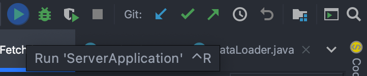

# Take My Books (BookYeet)

BookYeet is a community based book sharing app, where users are able to upload their book collection to allow them to give, take or swap books with other avid readers in their local area.

The app allows users to easily and quickly add books to be shared using the ISBN barcode number. They are then notified when a user requests that book, and are given the choice to share the book with that individual. The app then shares those users contact information to allow them to meet up and swap books.

## Setup/Installation

The app uses a JavaScript/React front end (client) and a Java/Spring backend (server). To setup the app for personal use:
### Server Setup

The server is most easily run through the IntelliJ IDEA Community app.<space><space>
[download IntelliJ](https://www.jetbrains.com/idea/download/#section=mac)

**An API key is required for the app to be able to communicate with the barcode API and generate books.**<space><space>
Get your API key from [barcodelookup.com](https://www.barcodelookup.com/api#sign-up). They offer a 30day free trial.

To add your API key to the app, create a new file in the `components` folder called `APIkey.java` and add the following code (replacing `your_key` with the key for barcodelookup).

    package com.codeclan.example.server.components;

    public class APIkey {
        private String key;
        public APIkey() {
            this.key = "your_key";
        }
        public String getKey() {
            return key;
        }
    }

Next in terminal starting from the root:

    $ cd server
    $ idea .

In IntelliJ hit the "Run" button in the top right corner of the app

### Client Setup
Install node dependencies starting from root folder:

    $ cd client
    $ npm install

Run the React App:

    $ npm start

## MVP

- Users should be able to both share their books and take books that are being shared.
- App is to be community focused for local people to share unwanted books within a geographical location (i.e. a specific city)

#### Books
Book will have:
- `Title`
- `Author`
- `Genre`
- `CurrentOwner` User object
- `ID` / `Barcode`
- `SwapHistory` User objects -- *Extension*

#### User
Users will have:
- `Collection of shared books`
- `Collection of owned books`
- `Community`
- `Requests` - list of requests

#### Book Taker
- Should be able to view all available books.
- Filter by genre/artist.
- Search by title.
- Request a book that is being shared.

#### Book Giver
- Should be able to add books to be shared.
- Should be able to delete books if they change their mind.
- Remove books when they are shared.
- Approve a request for a book.

## Extensions
- Book could view available books by location on a map based on a User's postcode outcode (e.g. EH12, EH3)
- Books could be added by scanning their barcode.
- Could be able to swap a book for a book the other user is offering.
- Users can create a 'WishList' of books they would like to swap for.
- Show users likely to swap by compatiblity of shared books and wishlist.

## Limitations

- App to be designed, developed and prototyped over a 7 day sprint.
- Developed by a team of 5 developers.
- App will assume user authentication has already been completed.

## API, Libraries, Resources
* [barcodelookup](https://www.barcodelookup.com/api#sign-up)
